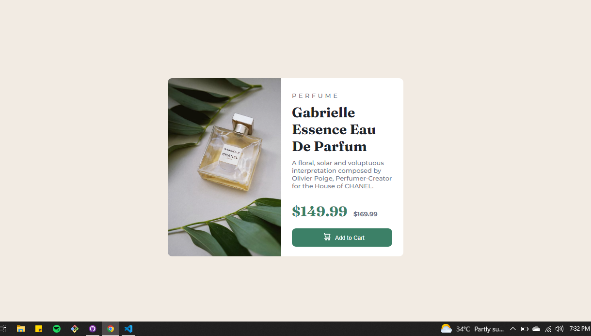

# Frontend Mentor - Product preview card component solution

This is a solution to the [Product preview card component challenge on Frontend Mentor](https://www.frontendmentor.io/challenges/product-preview-card-component-GO7UmttRfa). Frontend Mentor challenges help you improve your coding skills by building realistic projects. 

## Table of contents

- [Overview](#overview)
  - [The challenge](#the-challenge)
  - [Screenshot](#screenshot)
  - [Links](#links)
- [My process](#my-process)
  - [Built with](#built-with)
  - [What I learned](#what-i-learned)
  - [Continued development](#continued-development)
- [Author](#author)


## Overview

### The challenge

Users should be able to:

- View the optimal layout depending on their device's screen size
- See hover and focus states for interactive elements

### Screenshot




### Links

- Solution URL: [solution](https://github.com/mbilal-x/frontendmaster__P1_product-preview-card-component-main)
- Live Site URL: [live site](https://mbilal-x.github.io/frontendmaster__P1_product-preview-card-component-main/)

## My process

The idea was to use only flexbox, to get better grip at it.
I started out by making the mobile layout first.
I had the image uploaded in img tag, Which i had to change to to make image responsive later.
I then struggled with making the Image responsive, that is what took the most time.
The rest is just adding hover and focus states, and adjusting sizes. 

### Built with

- HTML5 markup
- CSS custom properties
- Flexbox
- Mobile-first workflow
- media queries
- no other library or framework


### What I learned

Use this section to recap over some of your major learnings while working through this project. Writing these out and providing code samples of areas you want to highlight is a great way to reinforce your own knowledge.


```css
.proud-of-this-css {
        background-image: url("/images/image-product-desktop.jpg");    
        background-position: cover;
        height: 410px;
        min-width: 260px;
        /* my first time making image responsive, adding background image to a div.
         It took a few days to get this part of the code to work right. */
}
```

### Continued development
I want to work on some more projects to find more stuff I can improve my understanding on.


## Author

- Website - [Muhammad Bilal]
- Frontend Mentor - [@mbilal-x](https://www.frontendmentor.io/profile/mbilal-x)

